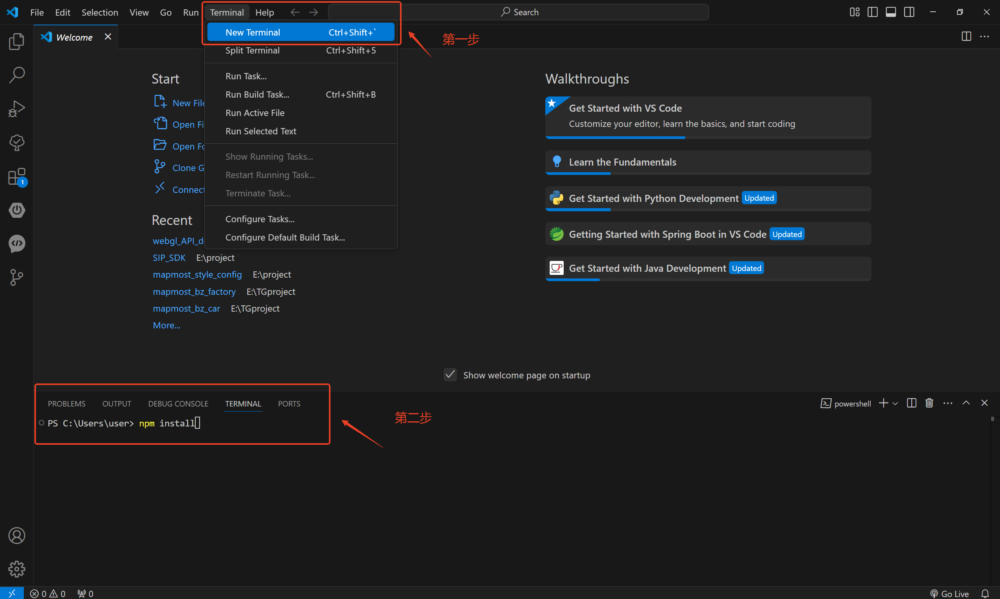

# 简介

本项目是基于 [Mapmost SDK for WebGL](https://www.mapmost.com/#/layout/webgl/home/) 实现的一个数字孪生智慧停车场案例，旨在助力停车场智能监控与安全管理。


>)

### 案例效果

[☞ 在线预览](https://www.bilibili.com/video/BV1LFQEY7EA4/)

[☞ 在线体验](https://delivery.mapmost.com/cdn/parking/dist/index.html)


### 案例功能

#### 1、总览
- 依托仿真的数字孪生实景，用户能够 360 度全方位查看停车场的整体概况，对停车场的布局、车位使用情况等一目了然。

#### 2、智慧停车
- 室外停车：提供精准的停车指引服务，通过智能算法快速规划路线，帮助车主迅速找到空余车位，节省停车时间。
- 智能找车：可便捷查看车辆所在位置，同时获取车辆的驶入时间、停车时长等详细信息，方便管理停车事务。

#### 3、智慧运维
- 智能充电：实时显示充电进度，让用户随时掌握充电状态，确保车辆充电过程顺利进行。
- 缴费审核：自动收集停车费用信息，实现高效的费用管理，并可远程控制栅栏开关，提升停车场出入口的通行效率。
- 监控管理：借助监控管理模块，对停车场的各个角落进行实时监控，做到安全无死角，保障停车场的安全运营。

### 项目运行

> 运行前请确保已经安装以下环境

- node.js (http://www.nodejs.com.cn/)

  #### 安装
  - 以 VS Code 为例，打开工程文件夹，点击 终端（Terminal） -> 新建终端（New Terminal），并在终端中输入“npm install”命令后回车即可。
  
    ```
    npm install
    ```
    
    

  #### 修改授权码

  > 运行前请确保已经免费获取 SDK 授权码

  - [☞ 点击免费申请](https://www.mapmost.com/#/productApply/webgl/?source_inviter=nqLdqFJp)
  - 在`src\components\Map.vue`文件中找到如下代码，将`userId`替换为您获取的授权码。
    ```js
    // 地图初始化
    let map = new mapmost.Map({
      container: "map-container",
      style: style_opacity,
      doubleClickZoom: false,
      center: [ 120.7298214801101, 31.286425440191394],
      zoom: 16.37586512074616,
      bearing: -48.16317736958848,
      pitch: 55.27710876023605,
      sky: "light",
      userId: "***", // 请输入您获取的授权码
      env3D: {
        defaultLights: false,
        exposure: 5,
      },
    });
    ```

  #### 运行
  用于启动并运行应用程序，以便开发人员在本地进行开发和测试。
  - 运行命令：
  ```
  npm run dev
  ```

    #### 替换模型
  如果你想要替换成自己的模型看一下效果，可以修改 Map.vue 中关于模型加载的方法：
  ```js
  // 设置模型资源
  let models_obj = [
    {
      type: 'glb', // 替换为你模型的格式，支持glb/gltf/fbx/obj
      url: './assets/models/SM_Parking.mm', // 模型文件路径，代码中以mm为后缀的模型文件是基于glb模型的Mapmost加密文件，需与decryptWasm参数配套使用
      decryptWasm:'https://delivery.mapmost.com/cdn/b3dm_codec/0.0.2-alpha/sdk_b3dm_codec_wasm_bg_opt.wasm',  // Mapmost加密模型的配置参数，非Mapmost加密模型加载无需设置该参数
      // mtl:'<your mtl url>' // 如果模型是obj格式的，需要增加该参数，将值替换为你模型材质的文件路径
      // dracoUrl:'https://delivery.mapmost.com/cdn/sdk/lib/draco/' // 如果模型是glb/gltf格式的，又经过几何压缩的，需要添加该参数进行解压
      // ktx2ParseUrl:'https://delivery.mapmost.com/cdn/sdk/lib/basis/' // 如果模型是glb/gltf格式的，又经过ktx2纹理压缩的，需要添加该参数进行解压
    },
  ];

  // 设置图层参数
  let options = {
    id: 'model_id1',    // 设置模型id
    models: models_obj, // 上述设置的模型资源
    outline: true,      // 是否允许轮廓高亮
    type: 'model',      // 图层类型
    funcRender: function (gl, matrix) {
      if (modelLayer) {
        modelLayer.renderMarker(gl, matrix);
      }
    },
    center: [120.73014920373011, 31.287414975761724, 0.1], // 如果你的模型有中心点坐标，则替换，如果没有，可以不变
    callback: function (group, layer) {
      // 其余代码省略
    },
  };
  ```

  #### 打包
  用于构建和打包你的应用程序，使其准备好在生产环境中部署。
  - 运行命令：
  ```
  npm run build
  ```

  ### 工程列表
  ``` shell
  vue-project/
  │
  ├── public/                     # 公共文件，不会被Webpack处理
  │   ├── assets                  # 静态资源，如模型、图片等
  │   └── libs                    # 引用文件
  │
  ├── src/                        # 源代码目录
  │   ├── api/                    # 地图场景控制
  │   │   ├── data.js             # 地图数据
  │   │   ├── MapApi.js           # 地图设置
  │   │   └── SceneApi.js         # 环境设置
  │   │
  │   ├── assets/                 # 静态资源，如图片等
  │   │   └── images/
  │   │
  │   ├── components/             # 公共组件
  │   │   └── Map.vue
  │   │
  │   ├── layout/                 # 页面文件
  │   │   ├── LyBottom.vue
  │   │   ├── LyLeft.vue
  │   │   ├── LyRight.vue
  │   │   └── LyTop.vue
  │   │
  │   ├── App.vue                 # 主组件
  │   ├── main.js                 # 入口文件，用于创建Vue实例
  │   └── style.css               # 样式文件
  │
  ├── .gitignore                  # Git忽略文件配置
  ├── .npmrc                      # npm安装包源配置
  ├── index.html                  # 主页HTML模板
  ├── package.json                # 项目依赖和配置信息
  ├── package-lock.json           # 依赖锁定文件
  ├── README.md                   # 项目说明文档
  └── vite.config.js              # Vue项目自定义配置
  ```

### 核心依赖

[Mapmost SDK for WebGL](https://www.mapmost.com/mapmost_docs/webgl/latest/docs/intro?source_inviter=nqLdqFJp)

### 核心能力
Mapmost SDK for WebGL 提供数据、服务、可视化、分析等7大类能力，该案例主要涉及以下功能：
- 模型加载
- 视角切换
- 模型动画
- 三维标签
- 三维地理围栏
- 实时视频接入
- 后期效果

### 更多参考

[Mapmost官网](https://www.mapmost.com/#/?source_inviter=nqLdqFJp)
